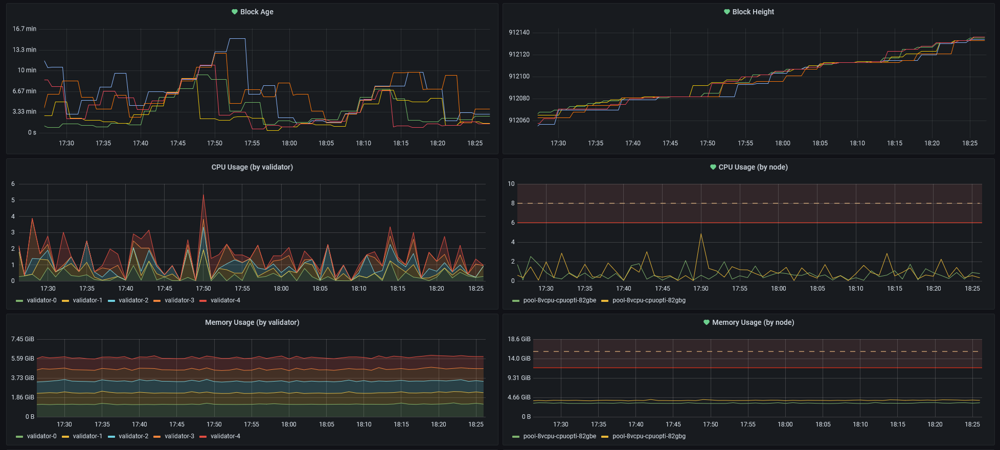

<h1>Helium Validators on Kubernetes (k8s)</h1>


This is a DigitalOcean-specific [Kubernetes (k8s)](https://kubernetes.io/) setup for running a cluster of [Helium validators](https://www.helium.com/stake). Some modifications are necessary to run on other Kubernetes hosts.

Development is still early and pull requests are welcome! ✌️

- [Local environment setup](#local-environment-setup)
  - [Extra tools](#extra-tools)
- [Cluster setup](#cluster-setup)
  - [Deploy the validators](#deploy-the-validators)
  - [Automatic updates](#automatic-updates)
  - [Modify disk space](#modify-disk-space)
- [Validator management](#validator-management)
  - [Check status](#check-status)
  - [Add a new validator](#add-a-new-validator)
  - [Staking validators](#staking-validators)
  - [Managing swarm keys](#managing-swarm-keys)
  - [Replace a swarm key](#replace-a-swarm-key)
- [Monitoring](#monitoring)
  - [Accessing Grafana](#accessing-grafana)
  - [Validator dashboard & alerting](#validator-dashboard--alerting)
  - [Remote Grafana access](#remote-grafana-access)
  - [Kubernetes dashboard (optional)](#kubernetes-dashboard-optional)
- [Misc](#misc)
  - [FAQ](#faq)
  - [How to contribute](#how-to-contribute)
  - [Thanks](#thanks)

# Local environment setup
All the core essentials you will need to get your environment setup:
- Install **kubectl**: 
`brew install kubectl` (or [Linux/Windows](https://kubernetes.io/docs/tasks/tools/))
- Install **doctl**: `brew install doctl` (or [Linux/Windows](https://www.digitalocean.com/docs/apis-clis/doctl/how-to/install/))
- Install **helm**: `brew install helm` (or [Linux/Windows](https://helm.sh/docs/intro/install/))
- Install **jq**: `brew install jq` or `sudo apt install jq`
- Install **base64**: `brew install base64` 

## Extra tools
Some very helpful tools to make your Kubernetes life easier:
- [🐶k9s](https://github.com/derailed/k9s) - A must have! K9s provides a terminal UI to interact with your Kubernetes clusters.
- [BotKube](https://www.botkube.io/) - BotKube is a messaging bot for monitoring and debugging Kubernetes clusters.


# Cluster setup

Create a new [Kubernetes cluster](https://cloud.digitalocean.com/kubernetes/clusters) on DigitalOcean. (i.e. 'helium-cluster')

Once setup, use `doctl` to download that cluster's config file locally, for use with `kubectl`. Also, create a [new API token](https://cloud.digitalocean.com/account/api/tokens/new) for yourself on DigitalOcean:

```sh
doctl auth init --context helium
Enter your access token: <DIGITALOCEAN API TOKEN HERE>

# now switch to the 'helium-cluster' context
doctl auth switch --context helium

# Download cluster's config file with doctl
doctl kubernetes cluster kubeconfig save helium-cluster
```

## Deploy the validators
Before you setup the validators, create a `helium` namespace and set it as your default:
```sh
kubectl create ns helium
kubectl config set-context --current --namespace helium
```

Create your `.env` file from the sample one provided.
```sh
cp .env.sample .env
```

The main env vars you'll need to setup are:
```sh
# Default namespace context as defined earlier
NAMESPACE=helium

# Default to latest or set a fixed version
VALIDATOR_MAINNET_VERSION=latest

# Number of validators you'd like to run
TOTAL_MAINNET_VALIDATORS=2

# To get the name of your cluster run `kubectl config current-context`
MAINNET_CLUSTER=do-nyc1-helium-cluster

# If you'd like to run a staging/testnet cluster, set the TESTNET env vars
VALIDATOR_TESTNET_VERSION=latest
TOTAL_TESTNET_VALIDATORS=1
TESTNET_CLUSTER=do-nyc1-helium-cluster-dev
```

The following script will automatically deploy everything you need to run and monitor your validators. 

```sh
scripts/deploy
# This automatically deploys 
# - k8s/exporter-service.yml
# - k8s/validator.yml
# - dynamic-hostports
# - kube-prometheus-stack (Prometheus & Grafana)
```

If you make changes to your validators in anyway you'll need to restart all of them by running:
```sh
scripts/deploy restart

# or

scripts/deploy
scripts/restart pod
```

You're all set! Try running `kubectl get pods` to see if everything is working. You should see something like:

```sh
NAME          READY   STATUS    RESTARTS   AGE
validator-0   2/2     Running   0          5m
validator-1   2/2     Running   0          5m
```

## Automatic updates

Validators will automatically update themselves whenever a new version is released. If a validator is currently in consensus, it will not update until it is out of consensus.

To disable auto updates, set the `VALIDATOR_MAINNET_VERSION` env var in your `.env` file to the version you'd like (e.g. `1.0.11`) and then run `./scripts/deploy restart` to update all validators.

## Modify disk space
By default, every validator will have 20GB of space each. If the validators start to need more space, you will have to modify each of your PVCs:
```sh
# To get the name of your PVC(s)
kubectl get pvc

# <new-size> = i.e. '40Gi'
kubectl patch pvc <your-pvc-name> -p '{ "spec": { "resources": { "requests": { "storage": "<new-size>" }}}}'
```


# Validator management
If you look inside the `/scripts` you'll see there are a bunch of helper scripts written to make validator management easier. Below are some of the most common uses: 

## Check status

Run this to see details on all your validators:

```sh
scripts/validator info

# Alternatively, you can specify the replica index to show a specific validator
scripts/validator info $replica_id
```

And then you should see something like this:
```
Pod: validator-1
Name: cool-hotspot-name
Address: 1YJSgoGPDpqC339KfysdfsdfVc4sG7JBJEUci1i1dKG
Version: 0.1.82
Validator API: https://api.helium.io/v1/validators/1YJSgoGPDpqC339KfysdfsdfVc4sG7JBJEUci1i1dKG
Not currently in consensus group
+---------+-------+
|  name   |result |
+---------+-------+
|connected|  no   |
|dialable |  yes  |
|nat_type |unknown|
| height  | 15145 |
+---------+-------+
```

## Add a new validator

- Edit `TOTAL_MAINNET_VALIDATORS` in your `.env` 
- Run `scripts/deploy` and the new validator(s) will automatically deploy.
- Run `kubectl get pods -w` to monitor the new pod and verify it launched.


## Staking validators
Please refer to [Helium's guide](https://docs.helium.com/mine-hnt/validators/testnet/wallet/) on staking a validator. To get a validator's address, use the `scripts/validator info` command as described above.

## Managing swarm keys

A validator will generate a `swarm_key` for itself when it is first created. If you'd like to download those keys, run:

```sh
scripts/swarm-keys sync
# keys will be saved to disk in the /keys/$hotspot-name folder
```

If you have [1Password CLI](https://1password.com/downloads/command-line/) installed, this script can automatically save all the swarm_keys to your vault! Get your vault's `UUID` and set the `OP_VAULT_UUID` in your `.env` file. Here's a quick way to fetch a UUID for your Personal vault:
```sh
op list vaults | jq -r '.[] | select(.name == "Private") | .uuid'
```

## Replace a swarm key

To copy a local swarm_key file to a particular validator replica, run:

```sh
scripts/swarm-keys replace $replica_id $path_to_swarm_key

# For example
scripts/swarm-keys replace 1 ~/path/to/swarm_key
```

And if you have the 1Password CLI setup (as described earlier), then you can use the name of your validator instead:
```sh
scripts/swarm-keys replace $replica_id $animal_hotspot_name
```

This will update the swarm_key and restart the specified pod replica.

# Monitoring 


## Accessing Grafana
Grafana and prometheus should already be running thanks to the deploy script. Now you can setup a proxy to your Grafana dashboard using:
```sh
scripts/dashboard/monitor
```

If successful, you should see the following:
```sh
Visit =>
Grafana: http://localhost:3000 
Prometheus query tool: http://localhost:9090
Alertmanager: http://localhost:9093
```

Visit [http://localhost:3000](http://localhost:3000) to see your Grafana dashboard.

## Validator dashboard & alerting
There is a custom validator dashboard that should have most everything you need. When in grafana, search for "Helium Validator Dashboard". There are a bunch of alerts setup already (i.e. get notified when a validator enters consensus). 

I plan to continue to make improvements to this dashboard often, so if you want those updates too, update your repo with the latest and then run:

```sh
scripts/dashboard/setup update-dashboard
```

_Note: This will automatically update the "Helium Validator Dashboard". If you made any modifications to that dashboard, they will be erased. Make a backup copy of your modified dashboard before updating._

Also, if you have improvements you'd like to make to the validator dashboard, please make a PR! After making edits, you can "sync" those changes to this repo by using

```sh
scripts/dashboard/download
# This will automatically download the Helium Validator Dashboard to k8s/grafana/grafana-validator-dashboard.yml
```

## Remote Grafana access
If you're looking to give others access to a Grafana dashboard (or just want to be able to access from anywhere) you can use [ExternalDNS](https://github.com/kubernetes-sigs/external-dns) to map a domain/subdomain to the Grafana pod. 

First, you'll need to [find your DNS provider](https://github.com/kubernetes-sigs/external-dns#running-externaldns) in this list. You can follow their instructions provided, but the process should look something like this:

First, edit these two YAML files: [k8s/grafana/external-dns-values.yml](/k8s/grafana/external-dns-values.yml) and [k8s/grafana/external-dns-service.yml](/k8s/grafana/external-dns-service.yml) and replace all the values with your own. Then run:

```sh
helm repo add bitnami https://charts.bitnami.com/bitnami

# Run the following to install the DNS resolver 
helm upgrade grafana-dns -f k8s/grafana/external-dns-values.yml bitnami/external-dns --install -n kube-prometheus-stack

# Now you'll create a LoadBalancer service that will map an external IP to a domain (or subomdain)
kubectl apply -f k8s/grafana/external-dns-service.yml -n kube-prometheus-stack

# After a few moments, external-dns should see the new LoadBalancer service and automatically update your DNS TXT records
```

## Kubernetes dashboard (optional)

DigitalOcean has the Kubernetes Dashboard setup for you already, but if you're running locally or on another host that doesn't have it, you can run:

```sh
scripts/setup-k8s-dashboard
```

_Note: I don't really use this dashboard much and primarily just use [k9s](https://github.com/derailed/k9s) and Grafana_

# Misc

## FAQ

**Which DigitalOcean Node Pool should I use?**
<br>I have been using CPU optimized node pool with 16GB of RAM and 8vCPUs. It's too early to tell if this is too powerful or not, but seems to perform well so far.

**How many validators can I run per node?**
<br>I believe it is safe to run 2-3 validators per node but this could change over time. I have yet to see more than one validator enter a CG per node and the CPU has barely climbed over 25% on average with occasional spikes up to 50%.

**Why does my `nat_type` say `unknown`?**
<br>This might seem concerning, but it's as expected. It has no effect on validator penalties. Since we are dealing with k8s and its complex networking setup, we have to give each validator a unique `NAT_EXTERNAL_PORT` (using [dyanmic-hostports](https://github.com/0blu/dynamic-hostports-k8s)) to bypass the miner's auto-NAT detection. This avoids it from being relayed but also defaults to `unknown`. It also means your validator will show up with a cool 🏴‍☠️ on the validator explorer 😎.

**k8s adds a lot overhead. Do the validators receive a lot of penalties?**
<br>Not enough data but it looks positive. Have had a few elections and majority have had zero penalties, and one lasted 9 rounds and accrued ~0.9 performance penalty. If you are using this setup, please share your data!

**How do I move a validator to a different node?**
<br>Since the validators are a [StatefulSet](https://kubernetes.io/docs/concepts/workloads/controllers/statefulset/) with no node affinity, simply delete the pod and k8s will evenly distribute the validator across your node pool.

**How do I make sure a validator always has the same IP?**
<br>A pod will always have the same IP unless it switches to a new node. So as long as you arent moving pods around, then it should stay the same. Improvements are welcome! i.e. You could make sure a pod has a specific node affinity, or use a LoadBalancer to assign a static IP per validator (which would cost $). 

_Note: All the scripts for managing validators (e.g. upgrading to a new validator version) will make sure to never restart a validator that is currently in consensus._

**Can I copy a snapshot from one validator to another?**
<br>Yes!
```sh
scripts/snapshot copy $replica_from $replica_to

# Example: This will take a snapshot from validator-0 and import into validator-2
scripts/snapshot copy 0 2
```

**Can the pods use the animal hotspot name instead of "validator-3"?**
<br>It's technically possible, but would be a lot of refactoring. I highly recommend just using Grafana to figure out the names of your validators (or use `scripts/validator info $replica_id`)

## How to contribute

PRs for bug fixes, improvements, and new features are all welcome. And please feel free to file [GitHub issues](https://github.com/caseypugh/helium-validator-k8s/issues) for bugs / enhancements or to check out the loose roadmap.

## Thanks
Huge thanks to the [DeWi team](https://dewialliance.medium.com/announcing-the-inaugural-dewi-grant-recipients-56b44b9b9b66) for helping fund this project. And special shoutout to [jamiew](https://twitter.com/jamiew)'s [validator-exporter-k8s](https://github.com/jamiew/validator-exporter-k8s) and [pootify](https://github.com/pootify).